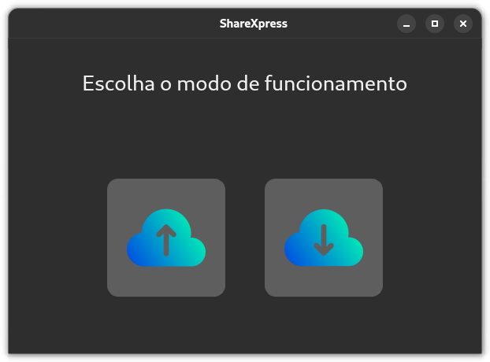

# ShareXpress

ShareXpress é um aplicativo de compartilhamento de arquivos desenvolvido para facilitar a transferência de arquivos entre dispositivos. Esta versão é a implementação em Python utilizando PyQt5 para a interface gráfica. Em breve, lançaremos uma versão para Android, permitindo que você compartilhe arquivos facilmente também em dispositivos móveis.

## Funcionalidades

- Envio de arquivos de um dispositivo para outro
- Recebimento de arquivos de outros dispositivos
- Interface gráfica amigável

## Instalação

### Pré-requisitos

- Python 3.6+
- PyQt5

### Passos para Instalação

1. Clone o repositório:

```sh
git clone https://github.com/ferreiratechlab/ShareXpress.git
cd ShareXpress
```

2. Instale as dependências:

```sh
pip install -r requirements.txt
```

3. Execute o aplicativo:

```sh
python main.py
```

## Uso

1. Abra o aplicativo.
2. Utilize os botões de "Enviar" e "Receber" para transferir arquivos entre dispositivos.

## Estrutura do Projeto

```
ShareXpress/
├── app/
│   ├── config.py
│   ├── gui/
│   │   ├── assets/
│   │   │   ├── app_icon.png
│   │   │   ├── download-da-nuvem.png
│   │   │   └── upload-na-nuvem.png
│   │   ├── components/
│   │   │   ├── file_item_widget.py
│   │   │   ├── __init__.py
│   │   │   └── __pycache__/
│   │   ├── __init__.py
│   │   ├── main_window.py
│   │   ├── __pycache__/
│   │   ├── receive_screen.py
│   │   └── send_screen.py
│   ├── __init__.py
│   ├── metadata/
│   ├── network/
│   │   ├── client.py
│   │   ├── __init__.py
│   │   ├── __pycache__/
│   │   ├── server.py
│   │   └── utils.py
│   ├── __pycache__/
│   ├── tests/
│   └── utils/
├── dist/
│   ├── ShareXpress-0.1.tar.gz
├── LICENSE
├── main.py
├── MANIFEST.in
├── README.md
├── requirements.txt
├── setup.py
└── ShareXpress.egg-info/
```

## Contribuição

Sinta-se à vontade para contribuir com o projeto. Você pode fazer isso das seguintes maneiras:

1. Fork o repositório
2. Crie uma nova branch (`git checkout -b feature/nome-da-sua-branch`)
3. Faça suas alterações e commit (`git commit -m 'Adicione uma nova feature'`)
4. Push para a branch (`git push origin feature/nome-da-sua-branch`)
5. Abra um Pull Request

## Licença

Este projeto está licenciado sob a licença GPL.

## Imagens do APP




## Contato

Para mais informações ou suporte, entre em contato:

- Email: ferreiratechlab@gmail.com
- GitHub: [ferreiratechlab](https://github.com/ferreiratechlab)

---

**Nota:** Estamos trabalhando na versão para Android do ShareXpress, que estará disponível em breve! Fique atento para mais atualizações e lançamentos
